<h2>TensorFlow-FlexUNet-Image-Segmentation-RSNA-Breast-Cancer-Subset (2026/07/06)</h2>
Sarah T. Arai 
Software Laboratory antillia.com  
This is the first experiment of Image Segmentation for <b>RSNA-Breast-Cancer-Subset</b> based on our 
<a href="https://github.com/sarah-antillia/TensorFlow-FlexUNet-Image-Segmentation-Model">
TensorFlow-FlexUNet-Image-Segmentation-Model</a> 
(TensorFlow Flexible UNet Image Segmentation Model for Multiclass) , 
and a 512x512 pixels PNG 
<a href="https://drive.google.com/file/d/1BUnBJJ8c4XgfaO663doMSFRhzReQed8G/view?usp=sharing">
<b>RSNA-Breast-Cancer-ImageMask-Subset.zip</b></a> 
(<a href="https://creativecommons.org/licenses/by-nc/4.0/legalcode.en">CC BY-NC 4.0)</a> with <b>AI generated pseudo colorized masks </b>(Benign:green, Malignant:red) 
which was derived by us from   
<a href="https://www.kaggle.com/datasets/theoviel/rsna-breast-cancer-512-pngs">
<b>RSNA Breast Cancer Detection - 512x512 pngs</b> </a> by Theo Viel.
  

<b>Actual Image Segmentation for RSNA-Breast-Cancer-Subset Images of 512x512 pixels </b> 
As shown below, the inferred masks predicted by our segmentation model trained by the dataset appear similar to the ground truth masks,
except the first and third cases.
  
<b>class_color_map = {Benign:green, Malignant:red}</b> 
 
<table border=1 style='border-collapse:collapse;' cellpadding='5'>
<tr>
<th>Input: image</th>
<th>Mask (ground_truth)</th>
<th>Prediction: inferred_mask</th>
</tr>
<tr>
<td>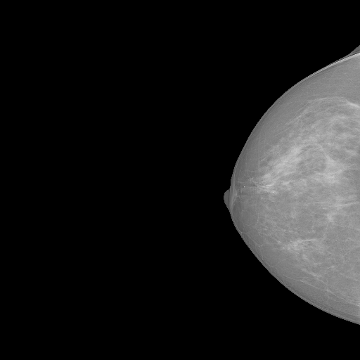</td>
<td>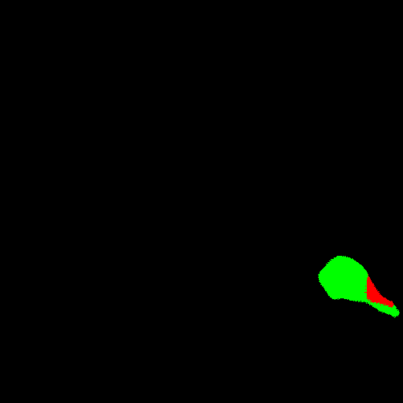</td>
<td>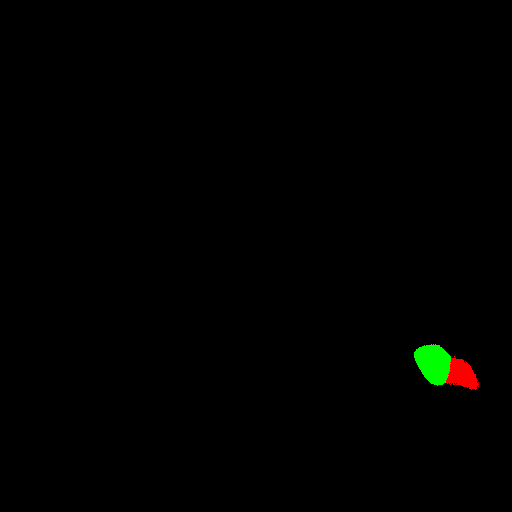</td>
</tr>
<tr>
<td>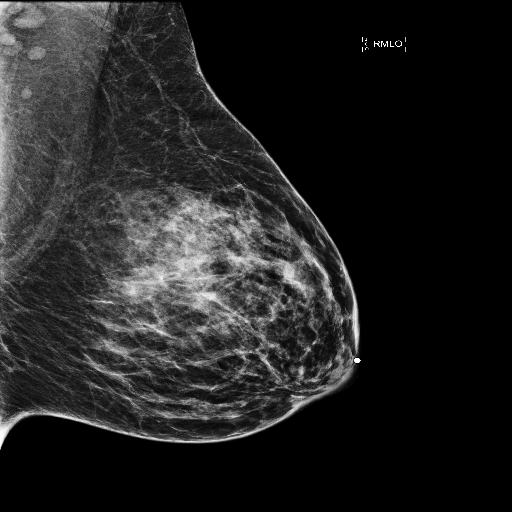</td>
<td>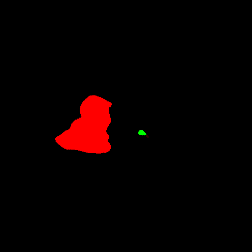</td>
<td>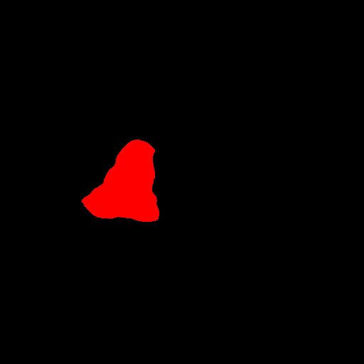</td>
</tr>
<tr>
<td>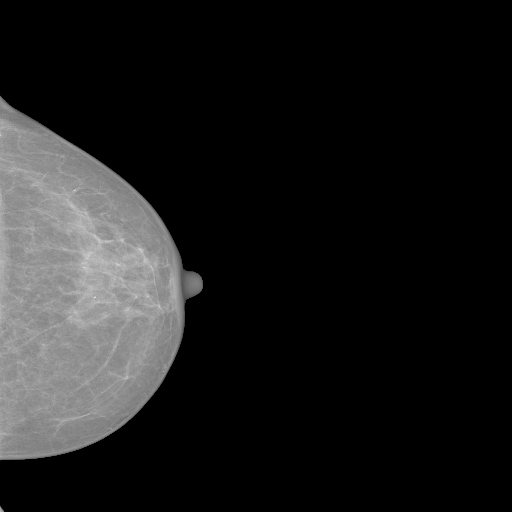</td>
<td>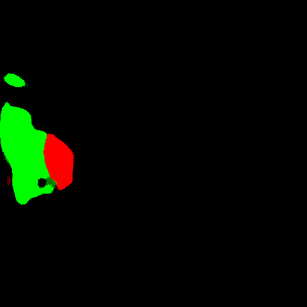</td>
<td>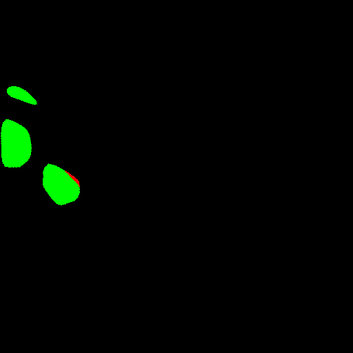</td>
</tr>
</table>

 
<h3>1  Dataset Citation</h3>
The dataset used here was derived from   
<a href="https://www.kaggle.com/datasets/orvile/aisslab-breast-cancer-dataset">
<a href="https://www.kaggle.com/datasets/theoviel/rsna-breast-cancer-512-pngs">
<b>RSNA Breast Cancer Detection - 512x512 pngs</b> </a> 
<b>Processed dicoms & resized to 512x512 for easier use</b> by Theo Viel.
  
The following explanation was taken from the above web site.
  
<b>About Dataset</b> 
Generated using <a href="https://www.kaggle.com/code/theoviel/dicom-resized-png-jpg">
https://www.kaggle.com/code/theoviel/dicom-resized-png-jpg
</a>
 
<ul>
<li>256x256 : <a href="https://www.kaggle.com/datasets/theoviel/rsna-breast-cancer-256-pngs">
https://www.kaggle.com/datasets/theoviel/rsna-breast-cancer-256-pngs
</a></li>
<li>512x512 : <a href="https://www.kaggle.com/datasets/theoviel/rsna-breast-cancer-512-pngs">
https://www.kaggle.com/datasets/theoviel/rsna-breast-cancer-512-pngs
</a></li>
<li>1024x1204:<a href=" https://www.kaggle.com/datasets/theoviel/rsna-breast-cancer-1024-pngs">
https://www.kaggle.com/datasets/theoviel/rsna-breast-cancer-1024-pngs
</a></li>
</ul>
The following description was taken from <a href="https://github.com/RSNA/AI-Challenge-Data/wiki/RSNA-Screening-Mammography-Breast-Cancer-Detection">
RSNA Screening Mammography Breast Cancer Detection
</a>. 
 
RSNA assembled this dataset in 2022 for the RSNA Screening Mammography Breast Cancer Detection AI Challenge 
(<a href="https://www.kaggle.com/competitions/rsna-breast-cancer-detection/">
https://www.kaggle.com/competitions/rsna-breast-cancer-detection/</a>). RSNA collected de-identified screening mammograms and supporting information from two sites, totaling just under 20,000 imaging studies.
 </a>). RSNA collected de-identified screening mammograms and supporting information from two sites, 
 totaling just under 20,000 imaging studies.
  
<b>Download</b> 
<a href="https://mira.rsna.org/dataset/3">Medical Imaging Resource for AI (MIRA)</a>
  
<b>License</b> 
You may access and use these de-identified imaging datasets and annotations (“the data”) for 
non-commercial purposes only, including academic research and education, 
as long as you agree to abide by the following provisions: 
Not to make any attempt to identify or contact any individual(s) who may be the subjects of the data.
 
 
<h3>
2 RSNA-Breast-Cancer-Subset ImageMask Subset
</h3>
<h3>
2.1 Download RSNA-Breast-Cancer-Subset ImageMask Subset
</h3>
 If you would like to train this RSNA-Breast-Cancer-Subset Segmentation model by yourself,
please download our dataset 
<a href="https://drive.google.com/file/d/1BUnBJJ8c4XgfaO663doMSFRhzReQed8G/view?usp=sharing">
<b>RSNA-Breast-Cancer-ImageMask-Subset.zip</b></a> 
(<a href="https://creativecommons.org/licenses/by-nc/4.0/legalcode.en">CC BY-NC 4.0)</a>
on the google drive,
expand the downloaded , and put it under <b>./dataset/</b> to be.
<pre>
./dataset
└─RSNA-Breast-Cancer-Subset
    ├─test
    │   ├─images
    │   └─masks
    ├─train
    │   ├─images
    │   └─masks
    └─valid
         ├─images
         └─masks
</pre>
 
<b>RSNA-Breast-Cancer-Subset Statistics</b> 
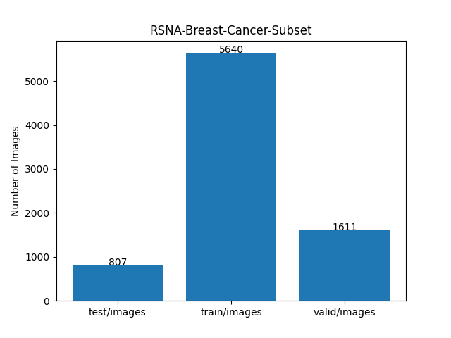 
 
As shown above, the number of images of train and valid datasets is enough to use for a training set of our segmentation model.
  
<h3>
2.2 Derivation of RSNA-Breast-Cancer-ImageMask-Subset
</h3>
The folder structure of the original <b>RSNA-Breast-Cancer-Detection</b> is the following. It contains no annotation (mask) files,
because it is an image classification dataset,
<pre>
./RSNA_Breast_Cancer_Detection (54,707 PNG files)
├─5_640805896.png
├─5_940388076.png
...
└─65534_1888933323.png
   
</pre>
<b>Step 1</b> 
We generated our own <b>pseudo colorized masks </b> (Benign:green, Malignant:red) corresponding to all 54,707 PNG files in RSNA_Breast_Cancer_Detection folder  
by applying an inference (segmentation) method of
a pretrained FlexUNet model <a href="https://github.com/sarah-antillia/TensorFlow-FlexUNet-Image-Segmentation-AISSLab-Breast-Cancer">
TensorFlow-FlexUNet-Image-Segmentation-AISSLab-Breast-Cancer
</a> to all RSNA_Breast_Cancer images, without human annotation experts.
  
<b>Step 2</b> 
We generated our own RSNA-Breast-Cancer-ImageMask-Dataset from all pairs of RSNA_Breast_Cancer images and
their corresponding pseudo masks by excluding all empty black masks and their corresponding images. 
 
 
<b>Step 3</b> 
We finally generated <b>RSNA-Breast-Cancer-ImageMask-Subset</b> from RSNA-Breast-Cancer-ImageMask-Dataset  
by reducing the fullset dataset to one-fifth of its total size, because the number of image and mask 
files of the fullset is 40,293 respectively, which is too large to use for our experiment. 
 
<b>
You could potentially create a more refined pseudo masks from RSNA-Breast-Cancer images
by applying a segmentation method of
a pretrained FlexUNet model trained by <b>RSNA-Breast-Cancer-ImageMask-Subset</b>
</a> to all cancer images.
</b>
 
 
<h3>
2.3 Train Sample Images and Masks
</h3>
<b>Train Sample Images</b> 
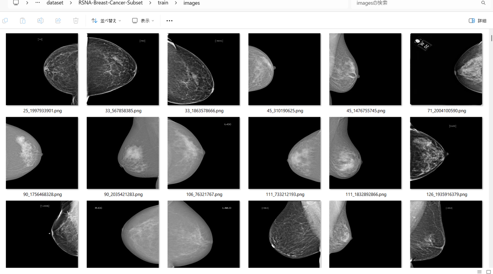
 
<b>Train Sample Masks</b> 
As shown below, some images contain a mixture of Benign(green) and Malignant(red) areas. 
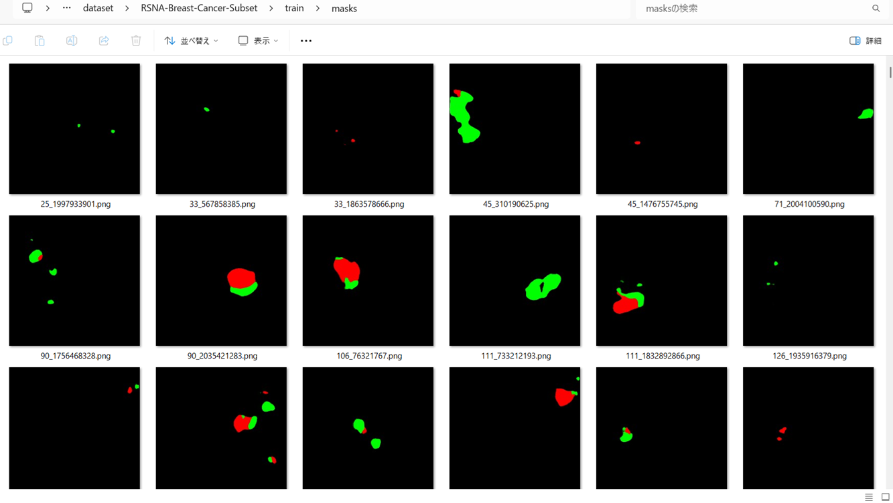
 
<h3>
3 Train TensorflowFlexUNet Model
</h3>
 We trained RSNA-Breast-Cancer-Subset TensorflowFlexUNet Model by using the following
<a href="./projects/TensorFlowFlexUNet/RSNA-Breast-Cancer-Subset/train_eval_infer.config"> <b>train_eval_infer.config</b></a> file.  
Please move to ./projects/TensorFlowFlexUNet/RSNA-Breast-Cancer-Subset and run the following bat file. 
<pre>
>1.train.bat
</pre>
, which simply runs the following command. 
<pre>
>python ../../../src/TensorFlowFlexUNetTrainer.py ./train_eval_infer.config
</pre>

<b>Model parameters</b> 
Defined a small <b>base_filters=16</b> and a large <b>base_kernels=(11,11)</b> for the first Conv Layer of Encoder Block of 
<a href="./src/TensorflowUNet.py">TensorflowUNet.py</a> 
and a large <b>num_layers=8</b> (including a bridge between Encoder and Decoder Blocks).
<pre>
[model]
image_width    = 512
image_height   = 512
image_channels = 3
input_normalize = True
normalization  = False
num_classes    = 3
base_filters   = 16
base_kernels  = (11,11)
num_layers    = 8

dropout_rate   = 0.05
dilation       = (1,1)
</pre>

<b>Learning rate</b> 
Defined a small learning rate.  
<pre>
[model]
learning_rate  = 0.00007
</pre>

<b>Loss and metrics functions</b> 
Specified "categorical_crossentropy" and "dice_coef_multiclass". 
<pre>
[model]
loss           = "categorical_crossentropy"
metrics        = ["dice_coef_multiclass"]
</pre>
<b >Learning rate reducer callback</b> 
Enabled learing_rate_reducer callback, and a small reducer_patience.
<pre> 
[train]
learning_rate_reducer = True
reducer_factor     = 0.5
reducer_patience   = 4
</pre>
<b>Early stopping callback</b> 
Enabled early stopping callback with patience parameter.
<pre>
[train]
patience      = 10
</pre>
<b></b> 
<b>RGB color map</b> 
rgb color map dict for RSNA-Breast-Cancer-Subset 3 classes. 
<pre>
[mask]
mask_file_format = ".png"
;RSNA-Breast-Cancer-Subset 1+2
;                  Benign:green, Malignant:red
rgb_map={(0,0,0):0,(0,255,0):1,(255,0,0):2,}
</pre>
<b>Epoch change inference callbacks</b> 
Enabled epoch_change_infer callback. 
<pre>
[train]
epoch_change_infer     = True
epoch_change_infer_dir =  "./epoch_change_infer"
epoch_change_tiled_infer     = False
epoch_change_tiled_infer_dir =  "./epoch_change_tiled_infer"
</pre>
By using this epoch_change_infer callback, on every epoch_change, the inference procedure can be called
 for 6 images in <b>mini_test</b> folder. This will help you confirm how the predicted mask changes 
 at each epoch during your training process. 
As shown below, early in the model training, the predicted masks from our UNet segmentation model showed discouraging results.
 However, as training progressed through the epochs, the predictions gradually improved.
 
     
<b>Epoch_change_inference output at starting (1,2,3)</b> 
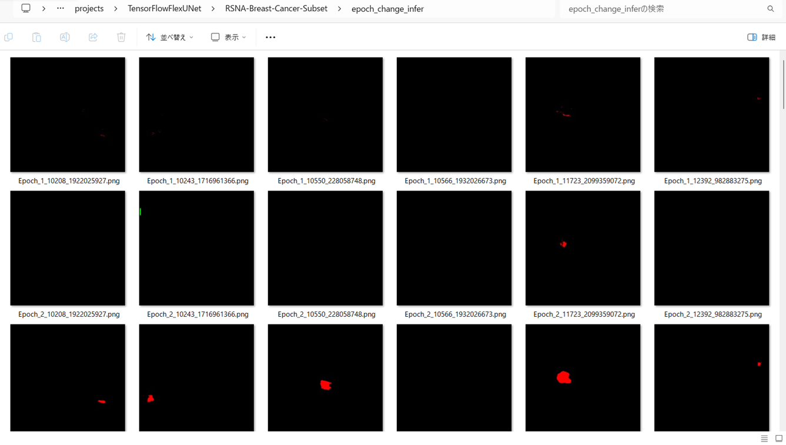 
 
<b>Epoch_change_inference output at middlepoint (10,11,12)</b> 
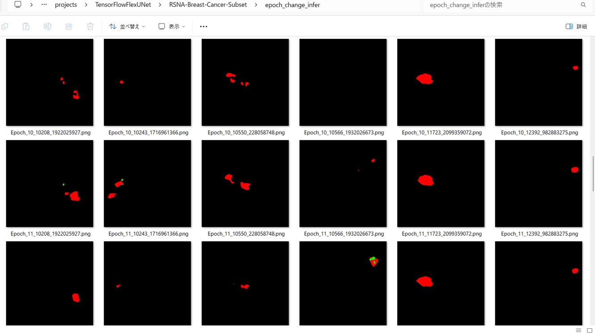 
 
<b>Epoch_change_inference output at ending (21,22,23)</b> 
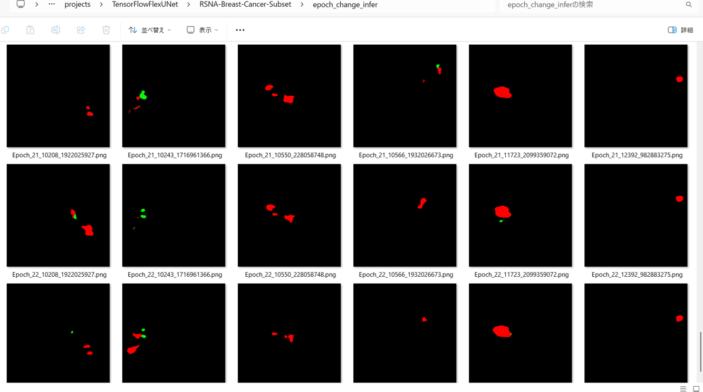 

 
In this experiment, the training process was stoppd at epoch 23 by EarlyStoppingCallback.  
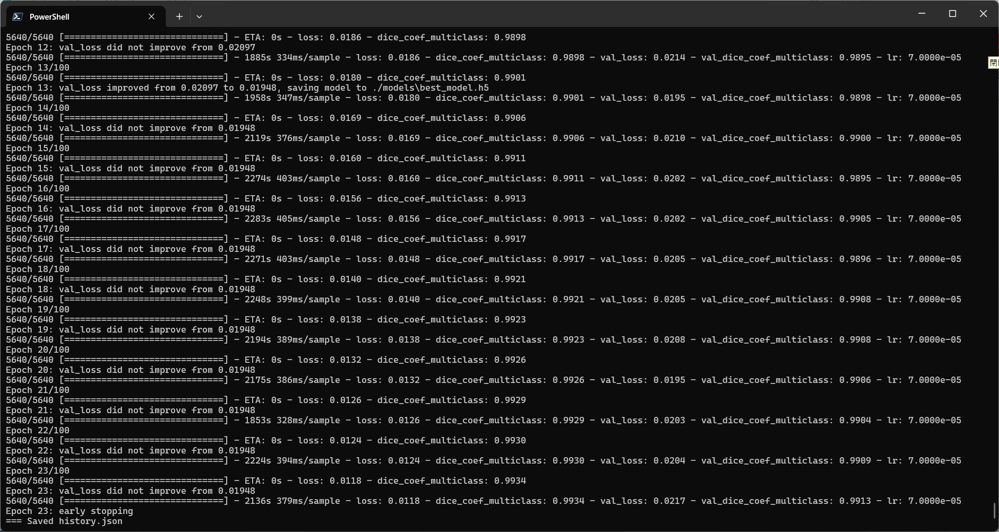 
 
<a href="./projects/TensorFlowFlexUNet/RSNA-Breast-Cancer-Subset/eval/train_metrics.csv">train_metrics.csv</a> 
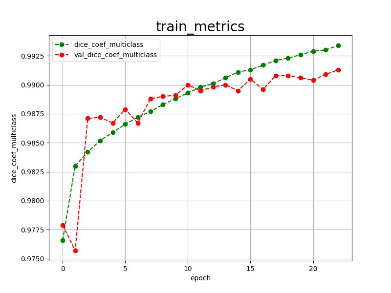 

 
<a href="./projects/TensorFlowFlexUNet/RSNA-Breast-Cancer-Subset/eval/train_losses.csv">train_losses.csv</a> 
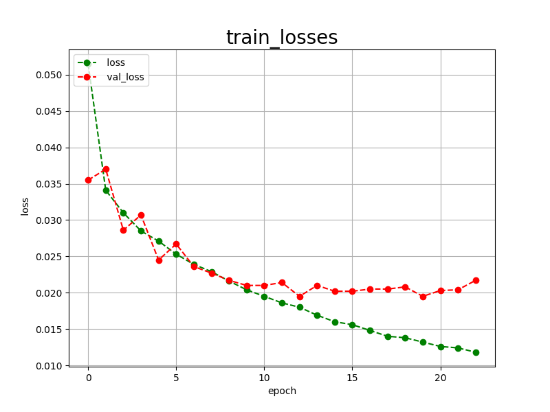 
 
<h3>
4 Evaluation
</h3>
Please move to <b>./projects/TensorFlowFlexUNet/RSNA-Breast-Cancer-Subset</b> folder, 
and run the following bat file to evaluate TensorflowFlexUNet model for RSNA-Breast-Cancer-Subset. 
<pre>
>./2.evaluate.bat
</pre>
This bat file simply runs the following command.
<pre>
>python ../../../src/TensorFlowFlexUNetEvaluator.py  ./train_eval_infer.config
</pre>
Evaluation console output: 
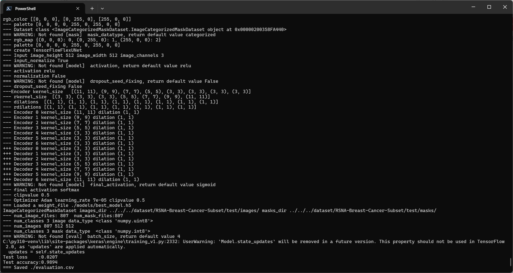
  Image-Segmentation-RSNA-Breast-Cancer-Subset

<a href="./projects/TensorFlowFlexUNet/RSNA-Breast-Cancer-Subset/evaluation.csv">evaluation.csv</a> 
The loss (categorical_crossentropy) to this RSNA-Breast-Cancer-Subset/test was not low, and dice_coef_multiclass not high as shown below.
 
<pre>
categorical_crossentropy,0.0207
dice_coef_multiclass,0.9894
</pre>
 
<h3>5 Inference</h3>
Please move to  <b>./projects/TensorFlowFlexUNet/RSNA-Breast-Cancer-Subset</b> folder 
,and run the following bat file to infer segmentation regions for images by the Trained-TensorflowFlexUNet model for RSNA-Breast-Cancer-Subset. 
<pre>
>./3.infer.bat
</pre>
This simply runs the following command.
<pre>
>python ../../../src/TensorFlowFlexUNetInferencer.py ./train_eval_infer.config
</pre>

<b>mini_test_images</b> 
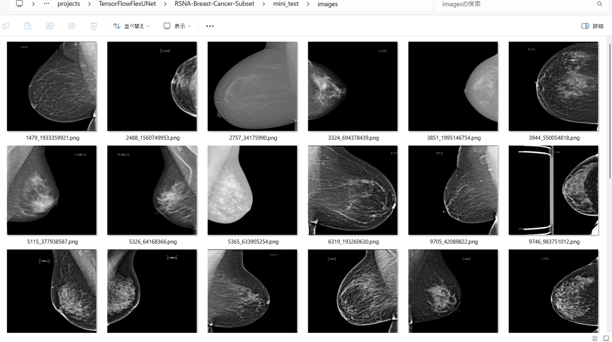 
<b>mini_test_mask(ground_truth)</b> 
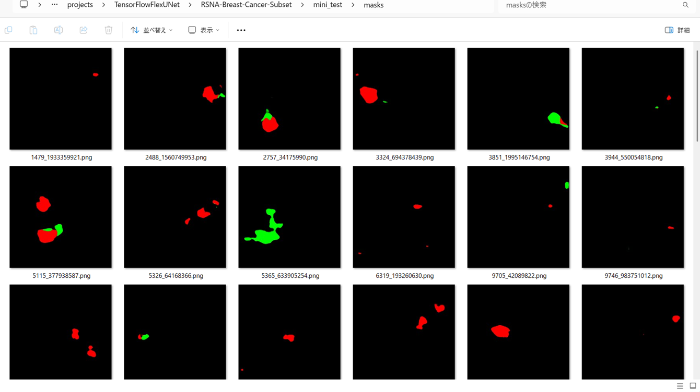 

<b>Inferred test masks</b> 
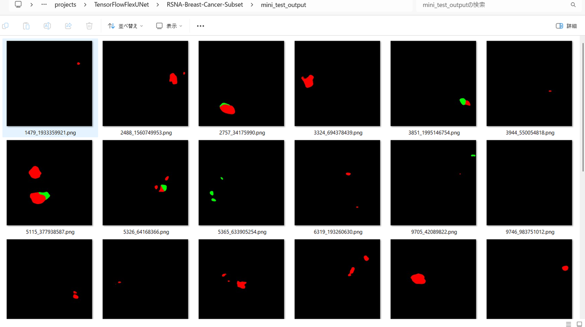 
 

<b>Enlarged images and masks for  RSNA-Breast-Cancer-Subset  Images of 512x512 pixels</b> 
As shown below, the inferred masks predicted by our segmentation model trained by the dataset appear similar to the ground truth masks, except the second and third cases.
 
 
<b>class_color_map = {Benign:green, Malignant:red}</b> 
 
<table border=1 style='border-collapse:collapse;' cellpadding='5'>
<tr>
<th>Input: image</th>
<th>Mask (ground_truth)</th>
<th>Prediction: inferred_mask</th>
</tr>
<tr>
<td>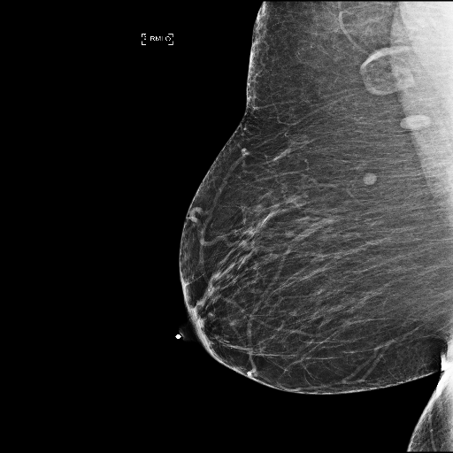</td>
<td>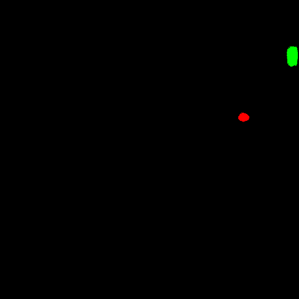</td>
<td>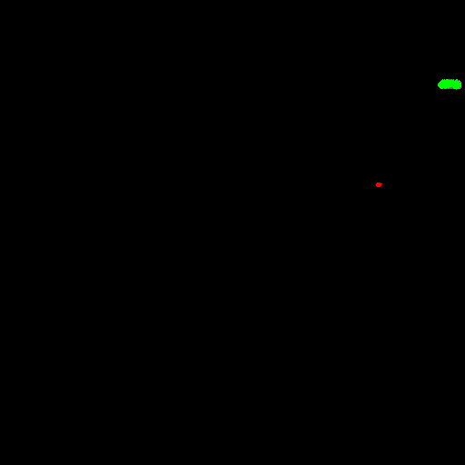</td>
</tr>

<tr>
<td>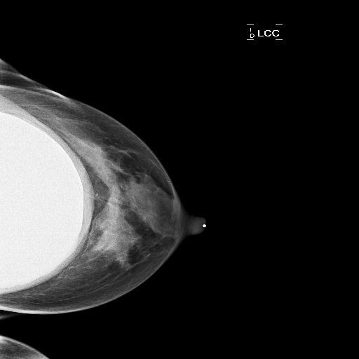</td>
<td>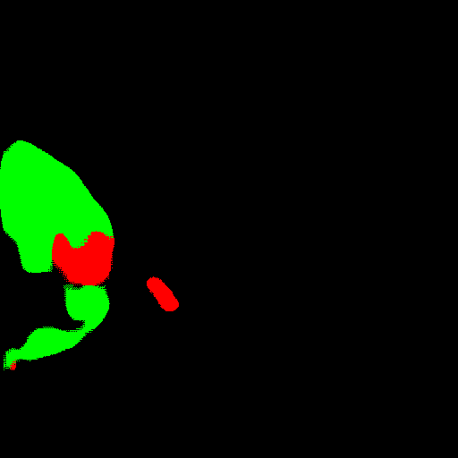</td>
<td>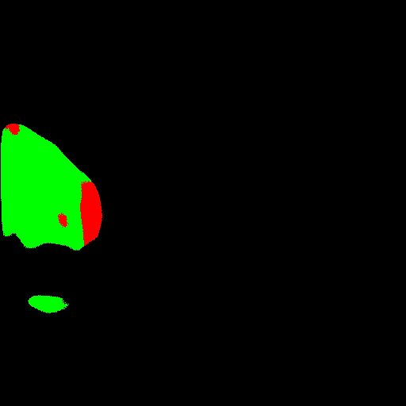</td>
</tr>

<tr>
<td>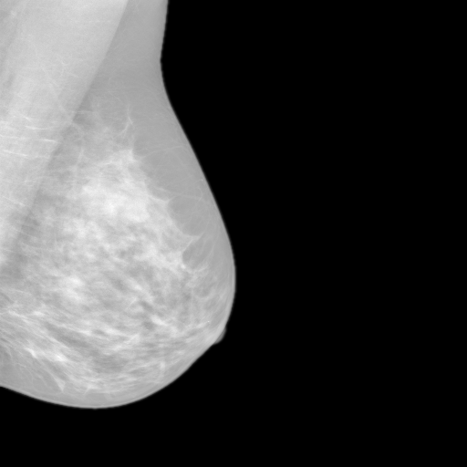</td>
<td>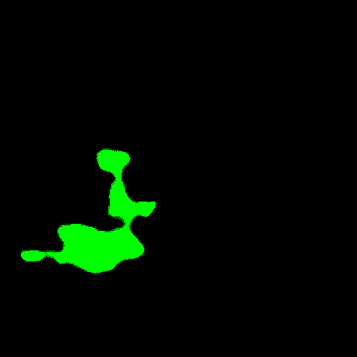</td>
<td>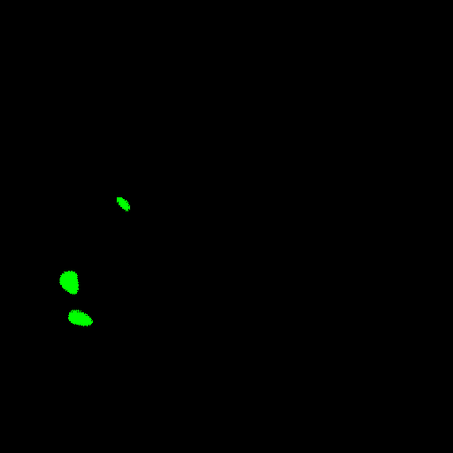</td>
</tr>
<tr>
<td>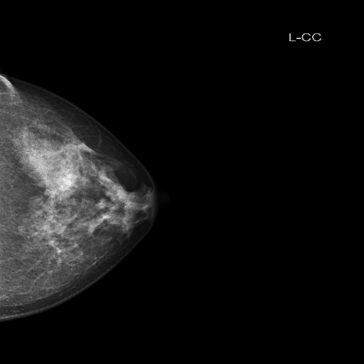</td>
<td>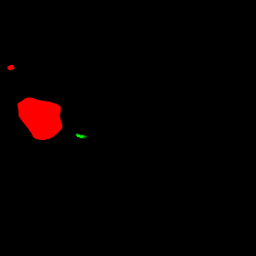</td>
<td>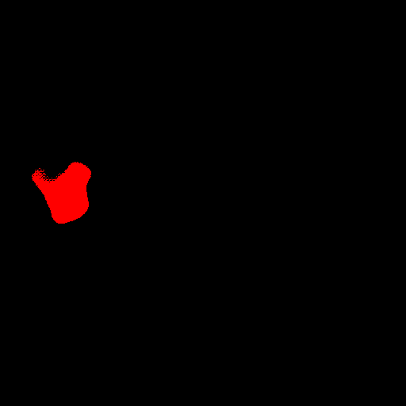</td>
</tr>
<tr>
<td>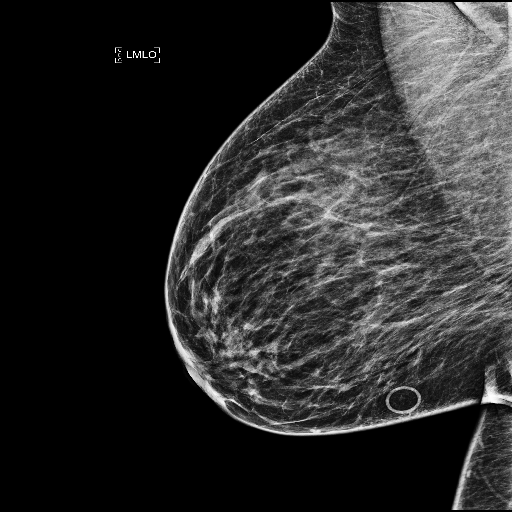</td>
<td></td>
<td>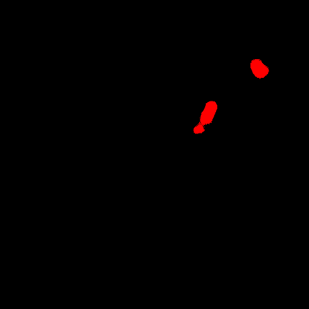</td>
</tr>
<tr>
<td>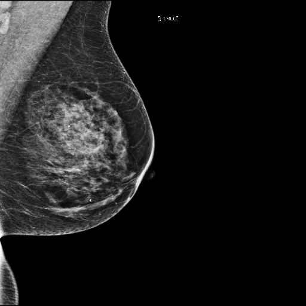</td>
<td>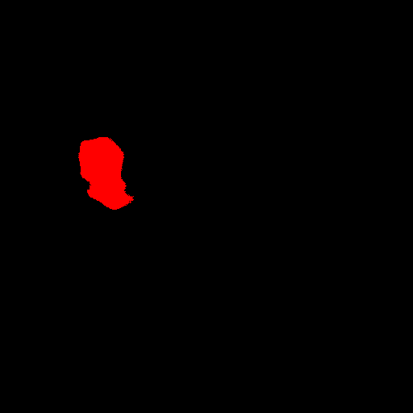</td>
<td>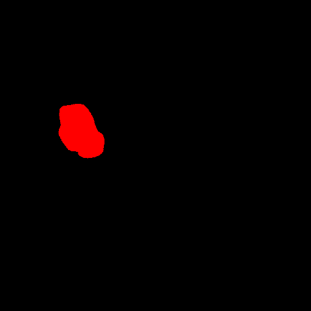</td>
</tr>
</table>

 
<h3>
References
</h3>
<b>1. TensorFlow-FlexUNet-Image-Segmentation-AISSLab-Breast-Cancer</b> 
Toshiyuki Arai  
<a href="https://github.com/sarah-antillia/TensorFlow-FlexUNet-Image-Segmentation-AISSLab-Breast-Cancer">
https://github.com/sarah-antillia/TensorFlow-FlexUNet-Image-Segmentation-AISSLab-Breast-Cancer
</a>
  
<b>2. TensorFlow-FlexUNet-Image-Segmentation-ISPY1-Breast-Cancer</b> 
Toshiyuki Arai  
<a href="https://github.com/sarah-antillia/TensorFlow-FlexUNet-Image-Segmentation-ISPY1-Breast-Cancer">
https://github.com/sarah-antillia/TensorFlow-FlexUNet-Image-Segmentation-ISPY1-Breast-Cancer
</a>
  
<b>3. TensorFlow-FlexUNet-Image-Segmentation-Breast-Cancer-Mammogram-Mastery</b> 
Toshiyuki Arai  
<a href="https://github.com/sarah-antillia/TensorFlow-FlexUNet-Image-Segmentation-Breast-Cancer-Mammogram-Mastery">
https://github.com/sarah-antillia/TensorFlow-FlexUNet-Image-Segmentation-Breast-Cancer-Mammogram-Mastery
</a>
  
<b>4. TensorFlow-FlexUNet-Image-Segmentation-MIAS-Mammogram</b> 
Toshiyuki Arai  
<a href="https://github.com/sarah-antillia/TensorFlow-FlexUNet-Image-Segmentation-MIAS-Mammogram">
https://github.com/sarah-antillia/TensorFlow-FlexUNet-Image-Segmentation-MIAS-Mammogram
</a>
  
<b>5. TensorFlow-FlexUNet-Image-Segmentation-Model</b> 
Toshiyuki Arai  
<a href="https://github.com/sarah-antillia/TensorFlow-FlexUNet-Image-Segmentation-Model">
https://github.com/sarah-antillia/TensorFlow-FlexUNet-Image-Segmentation-Model
</a>
 
 
